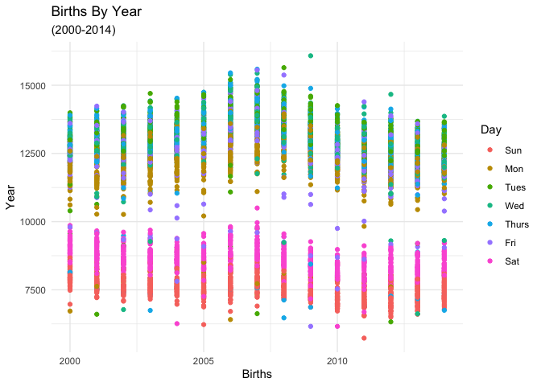
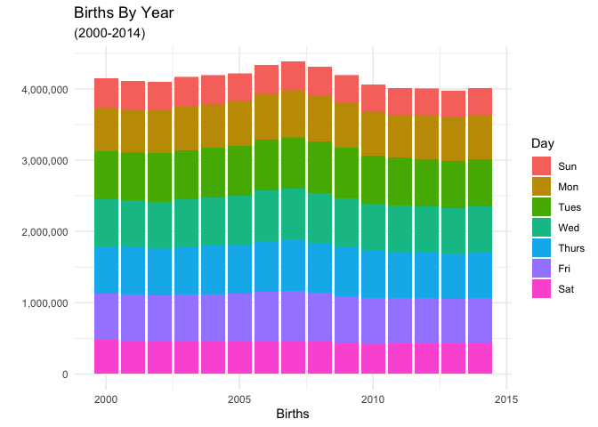
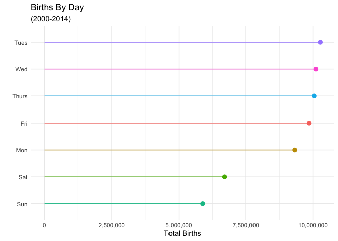
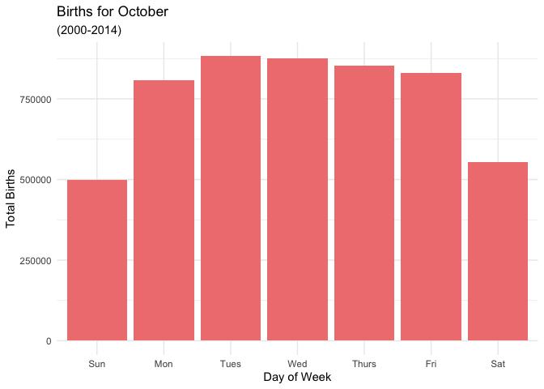

# Data Visualization 

> Katie Dills

## Mini-Project 1

I examined the US births, primarily focusing on the days of the week by birth count. I'm curious how much the data can differ by years and days as it should have equal probability to happen at random, just as birth genders do.


```r
library(tidyverse)
```

```
## ── Attaching packages ────────────────────────────────────────────────────────────────────────────────── tidyverse 1.3.0 ──
```

```
## ✔ ggplot2 3.3.2     ✔ purrr   0.3.3
## ✔ tibble  3.0.3     ✔ dplyr   0.8.3
## ✔ tidyr   1.0.0     ✔ stringr 1.4.0
## ✔ readr   1.3.1     ✔ forcats 0.4.0
```

```
## Warning: package 'ggplot2' was built under R version 3.6.2
```

```
## Warning: package 'tibble' was built under R version 3.6.2
```

```
## ── Conflicts ───────────────────────────────────────────────────────────────────────────────────── tidyverse_conflicts() ──
## ✖ dplyr::filter() masks stats::filter()
## ✖ dplyr::lag()    masks stats::lag()
```

```r
us_births <- read.csv("https://raw.githubusercontent.com/reisanar/datasets/master/us_births_00_14.csv")
```
# Summary of Data


```r
head(us_births)
```

<div data-pagedtable="false">
  <script data-pagedtable-source type="application/json">
{"columns":[{"label":[""],"name":["_rn_"],"type":[""],"align":["left"]},{"label":["year"],"name":[1],"type":["int"],"align":["right"]},{"label":["month"],"name":[2],"type":["int"],"align":["right"]},{"label":["date_of_month"],"name":[3],"type":["int"],"align":["right"]},{"label":["date"],"name":[4],"type":["fctr"],"align":["left"]},{"label":["day_of_week"],"name":[5],"type":["fctr"],"align":["left"]},{"label":["births"],"name":[6],"type":["int"],"align":["right"]}],"data":[{"1":"2000","2":"1","3":"1","4":"2000-01-01","5":"Sat","6":"9083","_rn_":"1"},{"1":"2000","2":"1","3":"2","4":"2000-01-02","5":"Sun","6":"8006","_rn_":"2"},{"1":"2000","2":"1","3":"3","4":"2000-01-03","5":"Mon","6":"11363","_rn_":"3"},{"1":"2000","2":"1","3":"4","4":"2000-01-04","5":"Tues","6":"13032","_rn_":"4"},{"1":"2000","2":"1","3":"5","4":"2000-01-05","5":"Wed","6":"12558","_rn_":"5"},{"1":"2000","2":"1","3":"6","4":"2000-01-06","5":"Thurs","6":"12466","_rn_":"6"}],"options":{"columns":{"min":{},"max":[10]},"rows":{"min":[10],"max":[10]},"pages":{}}}
  </script>
</div>

Average births by day of the week.

```r
us_births_mean <- us_births %>% 
  select(`day_of_week`, `births`) %>%
  group_by(`day_of_week`) %>%
  summarize(daily_avg = mean(`births`, na.rm = TRUE)) %>% 
  arrange(desc(daily_avg))

print(us_births_mean)
```

```
## # A tibble: 7 x 2
##   day_of_week daily_avg
##   <fct>           <dbl>
## 1 Tues           13122.
## 2 Wed            12911.
## 3 Thurs          12846.
## 4 Fri            12596.
## 5 Mon            11898.
## 6 Sat             8563.
## 7 Sun             7518.
```

Median births by day.

```r
us_births_median <- us_births %>% 
  select(`day_of_week`, `births`) %>%
  group_by(`day_of_week`) %>%
  summarize(daily_median = median(`births`, na.rm = TRUE)) %>% 
  arrange(desc(daily_median))

print(us_births_median)
```

```
## # A tibble: 7 x 2
##   day_of_week daily_median
##   <fct>              <dbl>
## 1 Tues              13198 
## 2 Thurs             12958 
## 3 Wed               12932 
## 4 Fri               12632.
## 5 Mon               12087 
## 6 Sat                8574 
## 7 Sun                7512
```

Interquartile Range of the births by day.

```r
us_births_IQR<- us_births %>% 
  select(`day_of_week`, `births`) %>%
  group_by(`day_of_week`) %>%
  summarize(daily_iqr = IQR(`births`, na.rm = TRUE)) %>% 
  arrange(desc(daily_iqr))

print(us_births_IQR)
```

```
## # A tibble: 7 x 2
##   day_of_week daily_iqr
##   <fct>           <dbl>
## 1 Fri              986.
## 2 Thurs            976.
## 3 Wed              948.
## 4 Tues             898.
## 5 Mon              890.
## 6 Sat              606.
## 7 Sun              518
```


```r
ordered_births <- us_births %>%
  mutate(day_of_week = factor(day_of_week, levels = c("Sun", "Mon", "Tues", "Wed", "Thurs", "Fri", "Sat")))
```


***

# Data Visualizations

### Births Per Year
First I wanted to observe how the birth counts fluctuated over the years.I created two different graphs to see the moevment, one by points and then one by bars to make sure I was getting an overall look at how the birth counts change by year. It does appear that there might be a correlation between which day of the week most births take place. It's obvious why the data points follow perfect lines, due to each line being a specific year. However it is interesting that there is significant gap between the birth couns and what day of the week they fall on at the 10,000 mark. My next graph takes a closer look at how the days compare to one another and overall birth counts. 


```r
ggplot(data = ordered_births) +
       geom_point(mapping = aes(x = year,
                                y = births,
                                color = `day_of_week`)) +
  labs(title = "Births By Year",
       subtitle = "(2000-2014)",
       x = "Births", 
       y = "Year",
       color = "Day") +
  theme_minimal()
```

<!-- -->


```r
ggplot(ordered_births, (aes(x = year, y = births, fill = day_of_week))) +
  scale_y_continuous(name = "", labels = scales::comma) +
  geom_bar(stat = 'identity') +
  labs(title = "Births By Year",
       subtitle = "(2000-2014)",
       x = "Births", 
       y = "Year",
       fill = "Day") +
  theme_minimal()
```

<!-- -->

### Births Per Day
Next I wanted to take a closer look at the total number of births by the day of the weeks. It's interesting that the days of the weeks all all pretty close to each other in totals except Saturday and Sunday. Since birth is a random act they should all be relatively equal, similar to the chances of having a boy or girl. The one exception to this would be scheduled C-sections. On occasion c-sections are neccesary, and it's known ahead of time so the doctor will schedule a specific day. Also when births have gone past the due date there is a point at which the doctors will induce labor. Although it's not as precise as c-sections inducing labor will typically take place within 24hrs. Both of these factors may be part of the reason for Saturday and Sunday's having less births; hospitals having less staff on weekends would most likely schedule inductions and c-sections during the week. 


```r
birth_days <- us_births %>% 
  group_by(day_of_week) %>%
  summarize(total_births = sum(`births`))


ggplot(birth_days,
       aes(x = reorder(day_of_week, total_births), y = total_births, 
           color = day_of_week)) +
  geom_pointrange(aes(ymin = 0, ymax = total_births)) +
  guides(color = FALSE) +
  labs(title = "Births By Day",
       subtitle = "(2000-2014)",
       x = "", 
       y = "") +
  theme_minimal() +
  scale_y_continuous(name = "Total Births", labels = scales::comma) +
  coord_flip()
```

<!-- -->

### Births For October
Out of pure curiosity I wondered how the births per day compared in just the month of October. My sister in-law is having a baby due at the end of the month and I wonder if she will have the child on the most common day for the month. Which appears to be on Tuesday, which is the the same as the most common day for all of the data.


```r
birth_month <- ordered_births %>%
  filter(month == 10) %>% 
  group_by(day_of_week) %>%
  summarize(total_births = sum(`births`))


ggplot(birth_month, (aes(x = day_of_week, y = total_births))) +
  geom_bar(stat = 'identity', fill = "lightcoral") +
  labs(title = "Births for October",
       subtitle = "(2000-2014)",
       x = "Day of Week",
       y = "Total Births") +
  theme_minimal()
```

<!-- -->

***
# Final Thoughts

After examining the dat through the summary portion I decided to primarily focus on the day of the work births took place. The data was very interesting as I played around with different graphs to better understand the data. Once I was able to see the how the data behaved, it made since why Saturday and Sunday's have less births compared to other days. I also played around with the themes of the graphs as well in order to pick which looked the most appealing.

***

