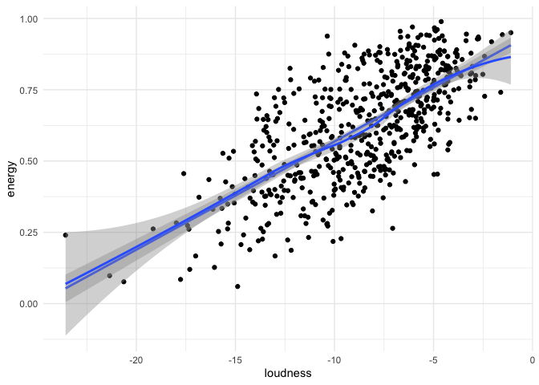
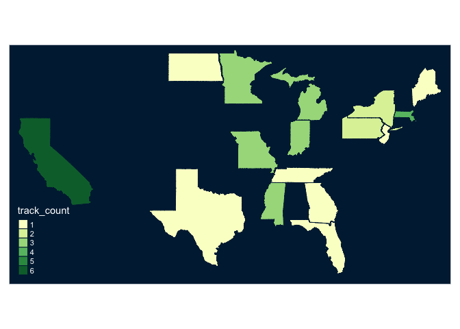

***

# Top Music Hits


```r
library(gapminder)
library(plotly)
```

```
## Warning: package 'plotly' was built under R version 3.6.2
```

```
## Loading required package: ggplot2
```

```
## Warning: package 'ggplot2' was built under R version 3.6.2
```

```
## 
## Attaching package: 'plotly'
```

```
## The following object is masked from 'package:ggplot2':
## 
##     last_plot
```

```
## The following object is masked from 'package:stats':
## 
##     filter
```

```
## The following object is masked from 'package:graphics':
## 
##     layout
```

```r
library(dplyr)
```

```
## 
## Attaching package: 'dplyr'
```

```
## The following objects are masked from 'package:stats':
## 
##     filter, lag
```

```
## The following objects are masked from 'package:base':
## 
##     intersect, setdiff, setequal, union
```

```r
library(tidyverse)
```

```
## ── Attaching packages ─────────────────────────────────────── tidyverse 1.3.0 ──
```

```
## ✔ tibble  3.0.3     ✔ purrr   0.3.3
## ✔ tidyr   1.0.0     ✔ stringr 1.4.0
## ✔ readr   1.3.1     ✔ forcats 0.4.0
```

```
## Warning: package 'tibble' was built under R version 3.6.2
```

```
## ── Conflicts ────────────────────────────────────────── tidyverse_conflicts() ──
## ✖ dplyr::filter() masks plotly::filter(), stats::filter()
## ✖ dplyr::lag()    masks stats::lag()
```

```r
library(tmaptools)
```

```
## Warning: package 'tmaptools' was built under R version 3.6.2
```

```r
library(tmap)
```

```
## Warning: package 'tmap' was built under R version 3.6.2
```

```r
library(sf)
```

```
## Warning: package 'sf' was built under R version 3.6.2
```

```
## Linking to GEOS 3.7.2, GDAL 2.4.2, PROJ 5.2.0
```

```r
top_hits <- read_csv("https://raw.githubusercontent.com/reisanar/datasets/master/all_billboard_summer_hits.csv")
```

```
## Parsed with column specification:
## cols(
##   .default = col_double(),
##   key = col_character(),
##   mode = col_character(),
##   track_uri = col_character(),
##   key_mode = col_character(),
##   playlist_name = col_character(),
##   playlist_img = col_character(),
##   track_name = col_character(),
##   artist_name = col_character(),
##   album_name = col_character(),
##   album_img = col_character()
## )
```

```
## See spec(...) for full column specifications.
```

```r
artists_states <- readxl::read_xlsx("/Users/katiedills/Desktop/Mini_Project2/data/artists_states.xlsx") 
```


```r
tail(top_hits)
```

<div data-pagedtable="false">
  <script data-pagedtable-source type="application/json">
{"columns":[{"label":["danceability"],"name":[1],"type":["dbl"],"align":["right"]},{"label":["energy"],"name":[2],"type":["dbl"],"align":["right"]},{"label":["key"],"name":[3],"type":["chr"],"align":["left"]},{"label":["loudness"],"name":[4],"type":["dbl"],"align":["right"]},{"label":["mode"],"name":[5],"type":["chr"],"align":["left"]},{"label":["speechiness"],"name":[6],"type":["dbl"],"align":["right"]},{"label":["acousticness"],"name":[7],"type":["dbl"],"align":["right"]},{"label":["instrumentalness"],"name":[8],"type":["dbl"],"align":["right"]},{"label":["liveness"],"name":[9],"type":["dbl"],"align":["right"]},{"label":["valence"],"name":[10],"type":["dbl"],"align":["right"]},{"label":["tempo"],"name":[11],"type":["dbl"],"align":["right"]},{"label":["track_uri"],"name":[12],"type":["chr"],"align":["left"]},{"label":["duration_ms"],"name":[13],"type":["dbl"],"align":["right"]},{"label":["time_signature"],"name":[14],"type":["dbl"],"align":["right"]},{"label":["key_mode"],"name":[15],"type":["chr"],"align":["left"]},{"label":["playlist_name"],"name":[16],"type":["chr"],"align":["left"]},{"label":["playlist_img"],"name":[17],"type":["chr"],"align":["left"]},{"label":["track_name"],"name":[18],"type":["chr"],"align":["left"]},{"label":["artist_name"],"name":[19],"type":["chr"],"align":["left"]},{"label":["album_name"],"name":[20],"type":["chr"],"align":["left"]},{"label":["album_img"],"name":[21],"type":["chr"],"align":["left"]},{"label":["year"],"name":[22],"type":["dbl"],"align":["right"]}],"data":[{"1":"0.825","2":"0.652","3":"C#","4":"-3.183","5":"minor","6":"0.0802","7":"0.581000","8":"0.00e+00","9":"0.0931","10":"0.931","11":"95.977","12":"7qiZfU4dY1lWllzX7mPBI3","13":"233713","14":"4","15":"C# minor","16":"summer_hits_2017","17":"https://mosaic.scdn.co/640/419e392fb9873bbb3eff0f4feccfe177840e1317bf41f93f8c895eff007b88bd2e23e12dfe078792e6a84983ed9b0a04ce633b021329f7df034e7c7cedcc53317411b5e025e920857fb0f871c4087ce9","18":"Shape of You","19":"Ed Sheeran","20":"÷ (Deluxe)","21":"https://i.scdn.co/image/e6a84983ed9b0a04ce633b021329f7df034e7c7c","22":"2017"},{"1":"0.784","2":"0.780","3":"A#","4":"-4.275","5":"minor","6":"0.1020","7":"0.049200","8":"0.00e+00","9":"0.1180","10":"0.722","11":"124.953","12":"5VKSZDsidOFHrtlJb33Syo","13":"204347","14":"4","15":"A# minor","16":"summer_hits_2017","17":"https://mosaic.scdn.co/640/419e392fb9873bbb3eff0f4feccfe177840e1317bf41f93f8c895eff007b88bd2e23e12dfe078792e6a84983ed9b0a04ce633b021329f7df034e7c7cedcc53317411b5e025e920857fb0f871c4087ce9","18":"Believer","19":"Imagine Dragons","20":"Evolve","21":"https://i.scdn.co/image/84989ed4cca6518fa540bb3c8a7a73127695e937","22":"2017"},{"1":"0.904","2":"0.611","3":"C#","4":"-6.842","5":"minor","6":"0.0888","7":"0.000259","8":"2.03e-05","9":"0.0976","10":"0.400","11":"150.020","12":"7KXjTSCq5nL1LoYtL7XAwS","13":"177000","14":"4","15":"C# minor","16":"summer_hits_2017","17":"https://mosaic.scdn.co/640/419e392fb9873bbb3eff0f4feccfe177840e1317bf41f93f8c895eff007b88bd2e23e12dfe078792e6a84983ed9b0a04ce633b021329f7df034e7c7cedcc53317411b5e025e920857fb0f871c4087ce9","18":"HUMBLE.","19":"Kendrick Lamar","20":"DAMN.","21":"https://i.scdn.co/image/661e1a935e2eacdd45c05ef618565535e7bed2ad","22":"2017"},{"1":"0.726","2":"0.769","3":"F#","4":"-5.043","5":"major","6":"0.1230","7":"0.029300","8":"1.01e-02","9":"0.1040","10":"0.733","11":"97.985","12":"3B54sVLJ402zGa6Xm4YGNe","13":"233902","14":"4","15":"F# major","16":"summer_hits_2017","17":"https://mosaic.scdn.co/640/419e392fb9873bbb3eff0f4feccfe177840e1317bf41f93f8c895eff007b88bd2e23e12dfe078792e6a84983ed9b0a04ce633b021329f7df034e7c7cedcc53317411b5e025e920857fb0f871c4087ce9","18":"Unforgettable","19":"French Montana","20":"Jungle Rules","21":"https://i.scdn.co/image/6fe3712b430fc0ff32e06b355014324a481f7a9c","22":"2017"},{"1":"0.731","2":"0.469","3":"F","4":"-7.226","5":"major","6":"0.0326","7":"0.463000","8":"1.04e-06","9":"0.1030","10":"0.631","11":"98.963","12":"7mldq42yDuxiUNn08nvzHO","13":"165387","14":"4","15":"F major","16":"summer_hits_2017","17":"https://mosaic.scdn.co/640/419e392fb9873bbb3eff0f4feccfe177840e1317bf41f93f8c895eff007b88bd2e23e12dfe078792e6a84983ed9b0a04ce633b021329f7df034e7c7cedcc53317411b5e025e920857fb0f871c4087ce9","18":"Body Like A Back Road","19":"Sam Hunt","20":"Body Like A Back Road","21":"https://i.scdn.co/image/8f386375d213edac195e5ed8e8368e145fb00dbf","22":"2017"},{"1":"0.627","2":"0.812","3":"F#","4":"-4.215","5":"major","6":"0.0358","7":"0.198000","8":"0.00e+00","9":"0.2120","10":"0.504","11":"123.071","12":"3a1lNhkSLSkpJE4MSHpDu9","13":"220293","14":"4","15":"F# major","16":"summer_hits_2017","17":"https://mosaic.scdn.co/640/419e392fb9873bbb3eff0f4feccfe177840e1317bf41f93f8c895eff007b88bd2e23e12dfe078792e6a84983ed9b0a04ce633b021329f7df034e7c7cedcc53317411b5e025e920857fb0f871c4087ce9","18":"Congratulations","19":"Post Malone","20":"Stoney (Deluxe)","21":"https://i.scdn.co/image/17e68a2e03de74a114bf6609d69f9bdbf6029f70","22":"2017"}],"options":{"columns":{"min":{},"max":[10]},"rows":{"min":[10],"max":[10]},"pages":{}}}
  </script>
</div>


```r
artist_count <-top_hits %>% 
  group_by(artist_name) %>% 
  summarise(track_count = sum(n())) %>% 
  arrange(desc(track_count))
print(artist_count)
```

```
## # A tibble: 468 x 2
##    artist_name        track_count
##    <chr>                    <int>
##  1 Rihanna                      7
##  2 Elton John                   6
##  3 Katy Perry                   6
##  4 Mariah Carey                 5
##  5 The Rolling Stones           5
##  6 Usher                        5
##  7 Donna Summer                 4
##  8 The Beatles                  4
##  9 Wings                        4
## 10 Bee Gees                     3
## # … with 458 more rows
```


```r
head(artists_states)
```

<div data-pagedtable="false">
  <script data-pagedtable-source type="application/json">
{"columns":[{"label":["artist_name"],"name":[1],"type":["chr"],"align":["left"]},{"label":["state"],"name":[2],"type":["chr"],"align":["left"]}],"data":[{"1":"Katy Perry","2":"California"},{"1":"Mariah Carey","2":"New York"},{"1":"Usher","2":"Texas"},{"1":"Donna Summer","2":"Massachusetts"},{"1":"Elvis Presley","2":"Mississippi"},{"1":"Eminem","2":"Missouri"}],"options":{"columns":{"min":{},"max":[10]},"rows":{"min":[10],"max":[10]},"pages":{}}}
  </script>
</div>

```r
class(artist_count)
```

```
## [1] "tbl_df"     "tbl"        "data.frame"
```


```r
artist_location <- right_join(artist_count, artists_states)
```

```
## Joining, by = "artist_name"
```

```r
print(artist_location)
```

```
## # A tibble: 29 x 3
##    artist_name   track_count state        
##    <chr>               <int> <chr>        
##  1 Katy Perry              6 California   
##  2 Mariah Carey            5 New York     
##  3 Usher                   5 Texas        
##  4 Donna Summer            4 Massachusetts
##  5 Elvis Presley           3 Mississippi  
##  6 Eminem                  3 Missouri     
##  7 Janet Jackson           3 Indiana      
##  8 Madonna                 3 Michigan     
##  9 Prince                  3 Minnesota    
## 10 Stevie Wonder           3 Michigan     
## # … with 19 more rows
```


***

# Data Visualizations

## Interactive Plot
### Danceability vs. Energy

After reviewing the top few artist by count of top hits, I decided to compare the dancebility and energy by artist. I chose Katy Perry, Mariah Carey, and Rihanna, due to my knowledge of their popular songs and knowing they are mostly upbeat songs. However after plotting the three I was surprised to see that Mariah Carey's song has much lower energy levels compared to Katy and Rihanna, although Rihanna also had a few top hits that were not as high energy as Katy.


```r
top_females <- filter(top_hits,
 artist_name %in% c("Rihanna", "Katy Perry", "Mariah Carey"))

head(top_females)
```

<div data-pagedtable="false">
  <script data-pagedtable-source type="application/json">
{"columns":[{"label":["danceability"],"name":[1],"type":["dbl"],"align":["right"]},{"label":["energy"],"name":[2],"type":["dbl"],"align":["right"]},{"label":["key"],"name":[3],"type":["chr"],"align":["left"]},{"label":["loudness"],"name":[4],"type":["dbl"],"align":["right"]},{"label":["mode"],"name":[5],"type":["chr"],"align":["left"]},{"label":["speechiness"],"name":[6],"type":["dbl"],"align":["right"]},{"label":["acousticness"],"name":[7],"type":["dbl"],"align":["right"]},{"label":["instrumentalness"],"name":[8],"type":["dbl"],"align":["right"]},{"label":["liveness"],"name":[9],"type":["dbl"],"align":["right"]},{"label":["valence"],"name":[10],"type":["dbl"],"align":["right"]},{"label":["tempo"],"name":[11],"type":["dbl"],"align":["right"]},{"label":["track_uri"],"name":[12],"type":["chr"],"align":["left"]},{"label":["duration_ms"],"name":[13],"type":["dbl"],"align":["right"]},{"label":["time_signature"],"name":[14],"type":["dbl"],"align":["right"]},{"label":["key_mode"],"name":[15],"type":["chr"],"align":["left"]},{"label":["playlist_name"],"name":[16],"type":["chr"],"align":["left"]},{"label":["playlist_img"],"name":[17],"type":["chr"],"align":["left"]},{"label":["track_name"],"name":[18],"type":["chr"],"align":["left"]},{"label":["artist_name"],"name":[19],"type":["chr"],"align":["left"]},{"label":["album_name"],"name":[20],"type":["chr"],"align":["left"]},{"label":["album_img"],"name":[21],"type":["chr"],"align":["left"]},{"label":["year"],"name":[22],"type":["dbl"],"align":["right"]}],"data":[{"1":"0.256","2":"0.463","3":"F","4":"-10.959","5":"major","6":"0.0382","7":"0.442000","8":"0.00e+00","9":"0.1210","10":"0.354","11":"205.362","12":"0gLQ6jhJsyYfl7PrD1RZ7X","13":"209293","14":"3","15":"F major","16":"summer_hits_1990","17":"https://mosaic.scdn.co/640/4209a8a482f0ff32a88b9afa58756e74affd4e3082f13700dfa78fa877a8cdecd725ad552c9a9653d2bef189de22ad152accc0dbe309cfadbefae5cddcf5918c83fa04fb4f3a54c506151538cf64a6fa","18":"Vision of Love","19":"Mariah Carey","20":"Mariah Carey","21":"https://i.scdn.co/image/82f13700dfa78fa877a8cdecd725ad552c9a9653","22":"1990"},{"1":"0.404","2":"0.511","3":"F","4":"-9.427","5":"major","6":"0.0315","7":"0.716000","8":"0.00e+00","9":"0.8710","10":"0.279","11":"82.025","12":"5jI2ApByK8KJeWVU39oRO4","13":"264160","14":"4","15":"F major","16":"summer_hits_1992","17":"https://mosaic.scdn.co/640/29fc8af1243817d5a4709c1a0ef2da16be8203f794fbdac812bcdfeed48206fc925951f9f6967ab6a3a08c33f8f9b84029045828fc98b7f77aa54de3a71b46bad155e2d98c5e19e47589b7cd8353859f","18":"I'll Be There","19":"Mariah Carey","20":"Greatest Hits","21":"https://i.scdn.co/image/a3a08c33f8f9b84029045828fc98b7f77aa54de3","22":"1992"},{"1":"0.649","2":"0.531","3":"E","4":"-8.335","5":"major","6":"0.0363","7":"0.457000","8":"0.00e+00","9":"0.2490","10":"0.488","11":"78.946","12":"2aBxt229cbLDOvtL7Xbb9x","13":"258133","14":"4","15":"E major","16":"summer_hits_1996","17":"https://mosaic.scdn.co/640/3f43322b89e08ef8380f28c5eac193d1a5864c2f4dfa362ed4ab99f705f7aa4ac2580ab5aec530dc54a2adc81acab52d3fdcb130efaf4c885c485d4c9a45024ed15a2f79bbdf7dd2504e5e06d3c2d9d3","18":"Always Be My Baby","19":"Mariah Carey","20":"Daydream","21":"https://i.scdn.co/image/0638f0ddf70003cb94b43aa5e4004d85da94f99c","22":"1996"},{"1":"0.400","2":"0.317","3":"G","4":"-10.249","5":"minor","6":"0.0317","7":"0.732000","8":"5.03e-05","9":"0.0860","10":"0.108","11":"107.845","12":"3RSpK5Y0y5tl25qvssrwJ6","13":"230933","14":"4","15":"G minor","16":"summer_hits_1998","17":"https://mosaic.scdn.co/640/2e7a199eb729f63a03454430e1afe8248e22157e662a03d20500459df4fc7438402a0231c29e68e1a4b4cd5f9c4ef7ef20c2122db4775ea68178478cebecc7491653d099b80c015d7cefec0ba3c4f5da","18":"My All","19":"Mariah Carey","20":"Butterfly","21":"https://i.scdn.co/image/3d20d386858e912f80dd4db9615138275a04efa7","22":"1998"},{"1":"0.838","2":"0.469","3":"C","4":"-7.992","5":"major","6":"0.0835","7":"0.035800","8":"0.00e+00","9":"0.0928","10":"0.778","11":"139.975","12":"3LmvfNUQtglbTrydsdIqFU","13":"201400","14":"4","15":"C major","16":"summer_hits_2005","17":"https://mosaic.scdn.co/640/7e69722d9c70eebd6e9ee07536ba0dbc4eefe5849290e725fec3b604a53603d77f567bba966b8b93d669caa7b4d476de43b57020e2f7008e6251a7cedca82bd9c1ccae90b09972027a408068f7a4d700","18":"We Belong Together","19":"Mariah Carey","20":"The Emancipation of Mimi","21":"https://i.scdn.co/image/dca82bd9c1ccae90b09972027a408068f7a4d700","22":"2005"},{"1":"0.768","2":"0.641","3":"G","4":"-8.320","5":"major","6":"0.2010","7":"0.000228","8":"5.71e-04","9":"0.0944","10":"0.462","11":"98.974","12":"4TsmezEQVSZNNPv5RJ65Ov","13":"246960","14":"4","15":"G major","16":"summer_hits_2005","17":"https://mosaic.scdn.co/640/7e69722d9c70eebd6e9ee07536ba0dbc4eefe5849290e725fec3b604a53603d77f567bba966b8b93d669caa7b4d476de43b57020e2f7008e6251a7cedca82bd9c1ccae90b09972027a408068f7a4d700","18":"Pon de Replay","19":"Rihanna","20":"Music Of The Sun","21":"https://i.scdn.co/image/9290e725fec3b604a53603d77f567bba966b8b93","22":"2005"}],"options":{"columns":{"min":{},"max":[10]},"rows":{"min":[10],"max":[10]},"pages":{}}}
  </script>
</div>


```r
my_plot <- ggplot(
  data = top_females,
  mapping = aes(x = danceability, y = energy, 
                color = artist_name)) +
  geom_point() +
  scale_x_log10() +
  theme_minimal()

ggplotly(my_plot)
```

<!--html_preserve--><div id="htmlwidget-2f16d4feb6946214d259" style="width:672px;height:480px;" class="plotly html-widget"></div>
<script type="application/json" data-for="htmlwidget-2f16d4feb6946214d259">{"x":{"data":[{"x":[-0.155522824254319,-0.280668713016273,-0.101823516502323,-0.187755303199631,-0.207608310501746,-0.289036881004724],"y":[0.76,0.878,0.754,0.815,0.869,0.683],"text":["danceability: 0.699<br />energy: 0.760<br />artist_name: Katy Perry","danceability: 0.524<br />energy: 0.878<br />artist_name: Katy Perry","danceability: 0.791<br />energy: 0.754<br />artist_name: Katy Perry","danceability: 0.649<br />energy: 0.815<br />artist_name: Katy Perry","danceability: 0.620<br />energy: 0.869<br />artist_name: Katy Perry","danceability: 0.514<br />energy: 0.683<br />artist_name: Katy Perry"],"type":"scatter","mode":"markers","marker":{"autocolorscale":false,"color":"rgba(248,118,109,1)","opacity":1,"size":5.66929133858268,"symbol":"circle","line":{"width":1.88976377952756,"color":"rgba(248,118,109,1)"}},"hoveron":"points","name":"Katy Perry","legendgroup":"Katy Perry","showlegend":true,"xaxis":"x","yaxis":"y","hoverinfo":"text","frame":null},{"x":[-0.59176003468815,-0.393618634889395,-0.187755303199631,-0.397940008672038,-0.0767559813697235],"y":[0.463,0.511,0.531,0.317,0.469],"text":["danceability: 0.256<br />energy: 0.463<br />artist_name: Mariah Carey","danceability: 0.404<br />energy: 0.511<br />artist_name: Mariah Carey","danceability: 0.649<br />energy: 0.531<br />artist_name: Mariah Carey","danceability: 0.400<br />energy: 0.317<br />artist_name: Mariah Carey","danceability: 0.838<br />energy: 0.469<br />artist_name: Mariah Carey"],"type":"scatter","mode":"markers","marker":{"autocolorscale":false,"color":"rgba(0,186,56,1)","opacity":1,"size":5.66929133858268,"symbol":"circle","line":{"width":1.88976377952756,"color":"rgba(0,186,56,1)"}},"hoveron":"points","name":"Mariah Carey","legendgroup":"Mariah Carey","showlegend":true,"xaxis":"x","yaxis":"y","hoverinfo":"text","frame":null},{"x":[-0.114638779968488,-0.228412519118745,-0.237321436272564,-0.151810883008601,-0.151195298948196,-0.147520006363144,-0.162411561764489],"y":[0.641,0.406,0.821,0.469,0.794,0.853,0.325],"text":["danceability: 0.768<br />energy: 0.641<br />artist_name: Rihanna","danceability: 0.591<br />energy: 0.406<br />artist_name: Rihanna","danceability: 0.579<br />energy: 0.821<br />artist_name: Rihanna","danceability: 0.705<br />energy: 0.469<br />artist_name: Rihanna","danceability: 0.706<br />energy: 0.794<br />artist_name: Rihanna","danceability: 0.712<br />energy: 0.853<br />artist_name: Rihanna","danceability: 0.688<br />energy: 0.325<br />artist_name: Rihanna"],"type":"scatter","mode":"markers","marker":{"autocolorscale":false,"color":"rgba(97,156,255,1)","opacity":1,"size":5.66929133858268,"symbol":"circle","line":{"width":1.88976377952756,"color":"rgba(97,156,255,1)"}},"hoveron":"points","name":"Rihanna","legendgroup":"Rihanna","showlegend":true,"xaxis":"x","yaxis":"y","hoverinfo":"text","frame":null}],"layout":{"margin":{"t":26.2283105022831,"r":7.30593607305936,"b":40.1826484018265,"l":43.1050228310502},"font":{"color":"rgba(0,0,0,1)","family":"","size":14.6118721461187},"xaxis":{"domain":[0,1],"automargin":true,"type":"linear","autorange":false,"range":[-0.617510237354072,-0.0510057787038022],"tickmode":"array","ticktext":["0.3","0.5","0.7"],"tickvals":[-0.522878745280338,-0.301029995663981,-0.154901959985743],"categoryorder":"array","categoryarray":["0.3","0.5","0.7"],"nticks":null,"ticks":"","tickcolor":null,"ticklen":3.65296803652968,"tickwidth":0,"showticklabels":true,"tickfont":{"color":"rgba(77,77,77,1)","family":"","size":11.689497716895},"tickangle":-0,"showline":false,"linecolor":null,"linewidth":0,"showgrid":true,"gridcolor":"rgba(235,235,235,1)","gridwidth":0.66417600664176,"zeroline":false,"anchor":"y","title":{"text":"danceability","font":{"color":"rgba(0,0,0,1)","family":"","size":14.6118721461187}},"hoverformat":".2f"},"yaxis":{"domain":[0,1],"automargin":true,"type":"linear","autorange":false,"range":[0.28895,0.90605],"tickmode":"array","ticktext":["0.3","0.4","0.5","0.6","0.7","0.8","0.9"],"tickvals":[0.3,0.4,0.5,0.6,0.7,0.8,0.9],"categoryorder":"array","categoryarray":["0.3","0.4","0.5","0.6","0.7","0.8","0.9"],"nticks":null,"ticks":"","tickcolor":null,"ticklen":3.65296803652968,"tickwidth":0,"showticklabels":true,"tickfont":{"color":"rgba(77,77,77,1)","family":"","size":11.689497716895},"tickangle":-0,"showline":false,"linecolor":null,"linewidth":0,"showgrid":true,"gridcolor":"rgba(235,235,235,1)","gridwidth":0.66417600664176,"zeroline":false,"anchor":"x","title":{"text":"energy","font":{"color":"rgba(0,0,0,1)","family":"","size":14.6118721461187}},"hoverformat":".2f"},"shapes":[{"type":"rect","fillcolor":null,"line":{"color":null,"width":0,"linetype":[]},"yref":"paper","xref":"paper","x0":0,"x1":1,"y0":0,"y1":1}],"showlegend":true,"legend":{"bgcolor":null,"bordercolor":null,"borderwidth":0,"font":{"color":"rgba(0,0,0,1)","family":"","size":11.689497716895},"y":0.913385826771654},"annotations":[{"text":"artist_name","x":1.02,"y":1,"showarrow":false,"ax":0,"ay":0,"font":{"color":"rgba(0,0,0,1)","family":"","size":14.6118721461187},"xref":"paper","yref":"paper","textangle":-0,"xanchor":"left","yanchor":"bottom","legendTitle":true}],"hovermode":"closest","barmode":"relative"},"config":{"doubleClick":"reset","showSendToCloud":false},"source":"A","attrs":{"be6337ca61fc":{"x":{},"y":{},"colour":{},"type":"scatter"}},"cur_data":"be6337ca61fc","visdat":{"be6337ca61fc":["function (y) ","x"]},"highlight":{"on":"plotly_click","persistent":false,"dynamic":false,"selectize":false,"opacityDim":0.2,"selected":{"opacity":1},"debounce":0},"shinyEvents":["plotly_hover","plotly_click","plotly_selected","plotly_relayout","plotly_brushed","plotly_brushing","plotly_clickannotation","plotly_doubleclick","plotly_deselect","plotly_afterplot","plotly_sunburstclick"],"base_url":"https://plot.ly"},"evals":[],"jsHooks":[]}</script><!--/html_preserve-->

***

### Visualizing Relationships


I then wanted to analyze the energy vs. loudness of the top hits. And logically, as the loudness increases so does the energy. Also interesting that of all the top hits there is a fairly good balance between energy and loudness with not to many outliers of being strongly towards either attribute.


```r
ggplot(top_hits, aes(x = loudness, y = energy)) +
  geom_point() +
  geom_smooth(method = "lm", 
              formula = "y ~ x") + 
  geom_smooth() +
  theme_minimal()
```

```
## `geom_smooth()` using method = 'loess' and formula 'y ~ x'
```

<!-- -->
***

### Spatial Relationships

My dataset did not have any location information, so in order to create a spatial relational graph I decided to take random artist name and create an additional file that included their birth place. Once I was able to do so I then used the shapefile to map out the relationship between where the artist is born and how many top hits they may have. It is very clear that California is the most common place for top hit artist to be born in, this may have to do with access to the music industry itself.


```r
library(sf)
temp_shapefile <- tempfile()
download.file("https://www2.census.gov/geo/tiger/GENZ2018/shp/cb_2018_us_state_500k.zip", temp_shapefile)
unzip(temp_shapefile)

sf_states <- read_sf('cb_2018_us_state_500k.shp')
```


```r
names(sf_states)[names(sf_states) == "NAME"] <- "state"
```


```r
head(sf_states)
```

<div data-pagedtable="false">
  <script data-pagedtable-source type="application/json">
{"columns":[{"label":["STATEFP"],"name":[1],"type":["chr"],"align":["left"]},{"label":["STATENS"],"name":[2],"type":["chr"],"align":["left"]},{"label":["AFFGEOID"],"name":[3],"type":["chr"],"align":["left"]},{"label":["GEOID"],"name":[4],"type":["chr"],"align":["left"]},{"label":["STUSPS"],"name":[5],"type":["chr"],"align":["left"]},{"label":["state"],"name":[6],"type":["chr"],"align":["left"]},{"label":["LSAD"],"name":[7],"type":["chr"],"align":["left"]},{"label":["ALAND"],"name":[8],"type":["dbl"],"align":["right"]},{"label":["AWATER"],"name":[9],"type":["dbl"],"align":["right"]},{"label":["geometry"],"name":[10],"type":["S3: sfc_MULTIPOLYGON"],"align":["right"]}],"data":[{"1":"28","2":"01779790","3":"0400000US28","4":"28","5":"MS","6":"Mississippi","7":"00","8":"121533519481","9":"3926919758","10":"<S3: sfc_MULTIPOLYGON>"},{"1":"37","2":"01027616","3":"0400000US37","4":"37","5":"NC","6":"North Carolina","7":"00","8":"125923656064","9":"13466071395","10":"<S3: sfc_MULTIPOLYGON>"},{"1":"40","2":"01102857","3":"0400000US40","4":"40","5":"OK","6":"Oklahoma","7":"00","8":"177662925723","9":"3374587997","10":"<S3: sfc_MULTIPOLYGON>"},{"1":"51","2":"01779803","3":"0400000US51","4":"51","5":"VA","6":"Virginia","7":"00","8":"102257717110","9":"8528531774","10":"<S3: sfc_MULTIPOLYGON>"},{"1":"54","2":"01779805","3":"0400000US54","4":"54","5":"WV","6":"West Virginia","7":"00","8":"62266474513","9":"489028543","10":"<S3: sfc_MULTIPOLYGON>"},{"1":"22","2":"01629543","3":"0400000US22","4":"22","5":"LA","6":"Louisiana","7":"00","8":"111897594374","9":"23753621895","10":"<S3: sfc_MULTIPOLYGON>"}],"options":{"columns":{"min":{},"max":[10]},"rows":{"min":[10],"max":[10]},"pages":{}}}
  </script>
</div>


```r
music_states <- merge(sf_states, artist_location, by.x = "state", by.y = "state")
head(music_states)
```

<div data-pagedtable="false">
  <script data-pagedtable-source type="application/json">
{"columns":[{"label":[""],"name":["_rn_"],"type":[""],"align":["left"]},{"label":["state"],"name":[1],"type":["chr"],"align":["left"]},{"label":["STATEFP"],"name":[2],"type":["chr"],"align":["left"]},{"label":["STATENS"],"name":[3],"type":["chr"],"align":["left"]},{"label":["AFFGEOID"],"name":[4],"type":["chr"],"align":["left"]},{"label":["GEOID"],"name":[5],"type":["chr"],"align":["left"]},{"label":["STUSPS"],"name":[6],"type":["chr"],"align":["left"]},{"label":["LSAD"],"name":[7],"type":["chr"],"align":["left"]},{"label":["ALAND"],"name":[8],"type":["dbl"],"align":["right"]},{"label":["AWATER"],"name":[9],"type":["dbl"],"align":["right"]},{"label":["artist_name"],"name":[10],"type":["chr"],"align":["left"]},{"label":["track_count"],"name":[11],"type":["int"],"align":["right"]},{"label":["geometry"],"name":[12],"type":["S3: sfc_MULTIPOLYGON"],"align":["right"]}],"data":[{"1":"California","2":"06","3":"01779778","4":"0400000US06","5":"06","6":"CA","7":"00","8":"403503931312","9":"20463871877","10":"Fergie","11":"1","12":"<S3: sfc_MULTIPOLYGON>","_rn_":"1"},{"1":"California","2":"06","3":"01779778","4":"0400000US06","5":"06","6":"CA","7":"00","8":"403503931312","9":"20463871877","10":"Gwen Stefani","11":"1","12":"<S3: sfc_MULTIPOLYGON>","_rn_":"2"},{"1":"California","2":"06","3":"01779778","4":"0400000US06","5":"06","6":"CA","7":"00","8":"403503931312","9":"20463871877","10":"Kendrick Lamar","11":"1","12":"<S3: sfc_MULTIPOLYGON>","_rn_":"3"},{"1":"California","2":"06","3":"01779778","4":"0400000US06","5":"06","6":"CA","7":"00","8":"403503931312","9":"20463871877","10":"Katy Perry","11":"6","12":"<S3: sfc_MULTIPOLYGON>","_rn_":"4"},{"1":"Florida","2":"12","3":"00294478","4":"0400000US12","5":"12","6":"FL","7":"00","8":"138949136250","9":"31361101223","10":"Ariana Grande","11":"1","12":"<S3: sfc_MULTIPOLYGON>","_rn_":"5"},{"1":"Florida","2":"12","3":"00294478","4":"0400000US12","5":"12","6":"FL","7":"00","8":"138949136250","9":"31361101223","10":"Flo Rida","11":"1","12":"<S3: sfc_MULTIPOLYGON>","_rn_":"6"}],"options":{"columns":{"min":{},"max":[10]},"rows":{"min":[10],"max":[10]},"pages":{}}}
  </script>
</div>


```r
tm_shape(music_states) +
  tm_polygons("track_count") +
  tm_borders()+
  tm_lines+
  tm_view(projection = 2163)+
  tmap_style("cobalt")
```

```
## tmap style set to "cobalt"
```

```
## other available styles are: "white", "gray", "natural", "col_blind", "albatross", "beaver", "bw", "classic", "watercolor"
```

```
## Warning in eval(substitute(expr), e): Scaling levels may be incorrect for this
## projection. Please specify a leaflet projection with leafletCRS for more control
```

```
## Warning: One tm layer group has duplicated layer types, which are omitted. To
## draw multiple layers of the same type, use multiple layer groups (i.e. specify
## tm_shape prior to each of them).
```

<!-- -->

***

## Conclusion

Overall this data set was very interesting to explore and is a large enough dataset that you could easily examine multiple different relationships and correlations between all of the aspects of the songs along with examining how they rank by the artist themselves. I didn't have any specific results I was expecting but rather wanting to see what relationships stood out, such as all of Katy Perry's top hits have high rankings for dancebility and energy compared to other top female artist. It was also interesting to see how the most successful artists are born in California, whether that is due to location and access to the music industry, or if it has more to do with the style of the music industry in the area and if it is more likely to be the most popular. Overall I struggled most with the spatial visualizations as the data did not already have any location formating so I collected my own data on the artist birthplace and created an addition csv to be joined.

***
