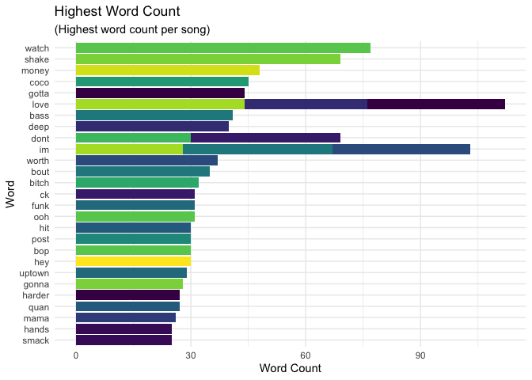

# Data Visualization Project 03


# Text Mining

## Top 100 Songs

I decided to use the text mining techniques I have learned over tha past few semesters to examine the lyrics of a few of the top hit songs.


```r
library(tidyverse)
```

```
## ── Attaching packages ────────────────────────────────────────────────────────────────────────────────── tidyverse 1.3.0 ──
```

```
## ✔ ggplot2 3.3.2     ✔ purrr   0.3.3
## ✔ tibble  3.0.3     ✔ dplyr   0.8.3
## ✔ tidyr   1.0.0     ✔ stringr 1.4.0
## ✔ readr   1.3.1     ✔ forcats 0.4.0
```

```
## Warning: package 'ggplot2' was built under R version 3.6.2
```

```
## Warning: package 'tibble' was built under R version 3.6.2
```

```
## ── Conflicts ───────────────────────────────────────────────────────────────────────────────────── tidyverse_conflicts() ──
## ✖ dplyr::filter() masks stats::filter()
## ✖ dplyr::lag()    masks stats::lag()
```

```r
library(tidytext)

billboard_top100 <- read_csv("https://raw.githubusercontent.com/reisanar/datasets/master/BB_top100_2015.csv")
```

```
## Parsed with column specification:
## cols(
##   Rank = col_double(),
##   Song = col_character(),
##   Artist = col_character(),
##   Year = col_double(),
##   Lyrics = col_character(),
##   Source = col_double()
## )
```

```r
head(billboard_top100)
```

```
## # A tibble: 6 x 6
##    Rank Song       Artist            Year Lyrics                          Source
##   <dbl> <chr>      <chr>            <dbl> <chr>                            <dbl>
## 1     1 uptown fu… mark ronson fea…  2015 this hit that ice cold michell…      1
## 2     2 thinking … ed sheeran        2015 when your legs dont work like …      1
## 3     3 see you a… wiz khalifa fea…  2015 its been a long day without yo…      1
## 4     4 trap queen fetty wap         2015 im like hey wassup hello seen …      1
## 5     5 sugar      maroon 5          2015 im hurting baby im broken down…      1
## 6     6 shut up a… walk the moon     2015 oh dont you dare look back jus…      1
```

***

#Word Count

First I wanted to take a look at the word count to better understand what words were used the most and who the artist of the songs were. The great thing about reviewing top hit songs with the highest word count for one particular song is that even though the name of the song is not listed I immediatley knew the first two songs.


```r
lyrics_tokens <- billboard_top100 %>% 
  unnest_tokens (word, Lyrics) %>%
  anti_join(stop_words, by = "word") %>%
  group_by(Artist) %>% 
  count(word, sort = TRUE) %>% 
  top_n(9, n) %>% 
  ungroup() %>% 
  mutate(word = fct_inorder(word))

head(lyrics_tokens)
```

```
## # A tibble: 6 x 3
##   Artist                       word      n
##   <chr>                        <fct> <int>
## 1 silento                      watch    77
## 2 taylor swift                 shake    69
## 3 usher featuring juicy j      money    48
## 4 ot genasis                   coco     45
## 5 ariana grande and the weeknd gotta    44
## 6 the weeknd                   love     44
```

I then decided to chart any words that were used by an artist of **25** times in a single song to see if any words were popular among multiple artist. As you can see in the graph below love is a very popular word for the billboard songs.


```r
lyrics_tokens %>% 
  filter(n >= 25) %>% 
ggplot(aes(x = n, y = fct_rev(word), fill = Artist)) +
  geom_col() +
  guides(fill = FALSE) +
  labs(x = NULL, y = NULL) +
  scale_fill_viridis_d()+
  labs(title = "Highest Word Count",
       subtitle = "(Highest word count per song)",
       x = "Word Count", 
       y = "Word") +
  theme_minimal()
```

<!-- -->

***

#Term Bigrams

I then decided to explore most used bigrams of the lyrics. I didn't care for the top word phrases as most were the same word being repeated which is common in songs. But I deicided against graphing these.


```r
lyrics_bigrams <- billboard_top100 %>% 
  unnest_tokens(bigram, Lyrics, token = "ngrams", n = 2) %>%
  separate(bigram, c("word1", "word2"), sep = " ") %>% 
  filter(!word1 %in% stop_words$word) %>% # remove stopwords
  filter(!word2 %in% stop_words$word) %>% # remove stopwords
  unite(bigram, word1, word2, sep = " ") %>% 
  group_by(Artist) %>% 
  count(bigram, sort = TRUE) %>% 
  top_n(9, n) %>% 
  ungroup() %>% 
  mutate(bigram = fct_inorder(bigram))

head(lyrics_bigrams)
```

```
## # A tibble: 6 x 3
##   Artist                           bigram          n
##   <chr>                            <fct>       <int>
## 1 ariana grande and the weeknd     gotta gotta    35
## 2 fifth harmony featuring kid ink  im worth       33
## 3 usher featuring juicy j          money money    32
## 4 mark ronson featuring bruno mars uptown funk    29
## 5 ot genasis                       coco coco      28
## 6 silento                          bop bop        26
```
***

#Term Sentiments

I looked at the sentiments of the lyrics, specifically whether the words are negative or positive. There was a wide range of net sentiment's however there seemed to be a lot more negative sentiments than positive. I picked a few sample artist and graphed their net sentiment to see how they compared with positive and negative sentiments from their songs. Once they were graphed, there appears to be more positive net sentiment songs than negative. However interestingly **Taylor Swift** had a song that was very negative, but it's not surprising considering she does come out with a large number of break up songs.


```r
lyrics_sentiment <- billboard_top100 %>% 
  unnest_tokens(word, Lyrics) %>%
  group_by(Artist) %>% 
  mutate(word_count = 1:n(),
         index = word_count %/% 500 + 1) %>% 
  inner_join(get_sentiments("bing")) %>%
  count(Artist, index = index, sentiment) %>% 
  pivot_wider(names_from = sentiment, values_from = n) %>%
  mutate(net_sentiment = positive - negative)
```

```
## Joining, by = "word"
```

```r
print(lyrics_sentiment)
```

```
## # A tibble: 111 x 5
## # Groups:   Artist [79]
##    Artist                       index negative positive net_sentiment
##    <chr>                        <dbl>    <int>    <int>         <int>
##  1 adele                            1       12        8            -4
##  2 alessia cara                     1       10       10             0
##  3 andy grammer                     1        5       17            12
##  4 ariana grande                    1        5        9             4
##  5 ariana grande and the weeknd     1       NA       40            NA
##  6 beyonce                          1       25       12           -13
##  7 beyonce                          2        3        4             1
##  8 big sean featuring drake         1       13       23            10
##  9 big sean featuring drake         2       11       13             2
## 10 big sean featuring e40           1       27        2           -25
## # … with 101 more rows
```


```r
top_artist_sentiment <- filter(lyrics_sentiment, Artist %in% c("the weeknd", "meghan trainor", "rihanna", "maroon 5", "beyonce", "drake", "nick jonas", "taylor swift", "sam smith"))


head(top_artist_sentiment)
```

```
## # A tibble: 6 x 5
## # Groups:   Artist [3]
##   Artist   index negative positive net_sentiment
##   <chr>    <dbl>    <int>    <int>         <int>
## 1 beyonce      1       25       12           -13
## 2 beyonce      2        3        4             1
## 3 drake        1        6       18            12
## 4 drake        2       10        8            -2
## 5 maroon 5     1       13       33            20
## 6 maroon 5     2       35       23           -12
```


```r
ggplot(top_artist_sentiment, 
       aes(x = index, y = net_sentiment, fill = net_sentiment > 0)) +
  geom_col() +
  guides(fill = FALSE) +  
  labs(x = NULL, y = "Net sentiment") +
  scale_fill_manual(name = "", labels = c("Positive", "Negative"),
                     values = c("#FF851B", "#3D9970")) +
  facet_wrap(vars(Artist), scales = "free_x") +
  labs(title = "Song Sentiment",
       subtitle = "(Sample Artist Song Sentiment)",
       x = "Index", 
       y = "Net Sentiment") +
  theme_minimal()
```

<!-- -->

***

#Term Frequency

Lastly I reviewed the lyrics frequency however I didn't like how the term frequencies appeared so I decided not to graph this set either.


```r
lyrics_words <- billboard_top100 %>% 
  unnest_tokens(word, Lyrics) %>% 
  count(Artist, word, sort = TRUE) %>% 
  ungroup()

lyrics_tf_idf <- lyrics_words %>% 
  bind_tf_idf(word, Artist, n) %>%
  arrange(desc(tf_idf))

lyrics_tf_idf_plot <- lyrics_tf_idf %>% 
  group_by(Artist) %>% 
  top_n(8) %>% 
  ungroup() %>% 
  mutate(word = fct_inorder(word))
```

```
## Selecting by tf_idf
```

```r
head(lyrics_tf_idf_plot)
```

```
## # A tibble: 6 x 6
##   Artist        word          n     tf   idf tf_idf
##   <chr>         <fct>     <int>  <dbl> <dbl>  <dbl>
## 1 ot genasis    coco         45 0.136   3.70  0.505
## 2 silento       watch        77 0.189   2.09  0.396
## 3 x ambassadors hey          30 0.217   1.69  0.367
## 4 silento       bop          30 0.0737  4.39  0.324
## 5 x ambassadors renegades    10 0.0725  4.39  0.318
## 6 mr probz      drifting      8 0.0635  4.39  0.279
```

***

# Final Thoughts

The top billboard song lyrics made great data sets for text mining purposes. The most interesting aspects I found in this dataset were the word with the highest count from songs and the net sentiments of the songs. The word count was interesting as the songs are very obvious from of key word alone, such as the song *Shake It Off*. Also the song sentiments are interesting as there are both negative and positive sentiments across the top billboard songs. Also the topics that the artist tend to sing about show in the sentiments as well, for example Taylor Swift having a song with a large amount of negative sentiments. 


***
